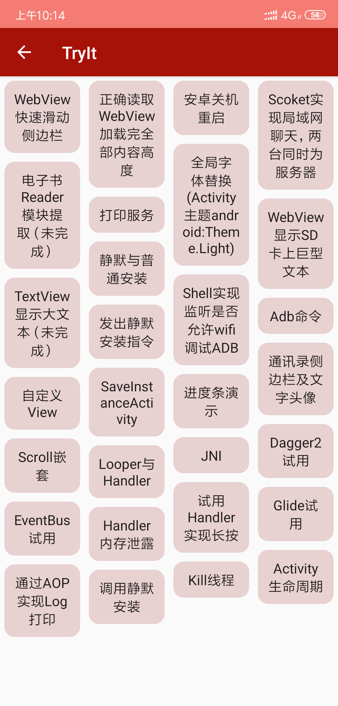

## TryIt

Some android and java demos

## Screenshot

  

## Guide
- [通过AOP实现Log打印](https://github.com/54wall/TryIt/tree/master/app/src/main/java/pri/weiqiang/tryit/aop)
- [权限工具类](https://github.com/54wall/TryIt/tree/master/app/src/main/java/pri/weiqiang/tryit/permission)
- [RecycleView添加SeekBar](https://github.com/54wall/TryIt/tree/master/app/src/main/java/pri/weiqiang/tryit/seekbar)
- [WebView快速滑动侧边栏](https://github.com/54wall/TryIt/tree/master/app/src/main/java/pri/weiqiang/tryit/seekbar)
- [正确读取WebView加载完全部内容高度](https://github.com/54wall/TryIt/tree/master/app/src/main/java/pri/weiqiang/tryit/webview)
- [安卓关机重启](https://github.com/54wall/TryIt/tree/master/app/src/main/java/pri/weiqiang/tryit/shutdown)
- [Scoket实现局域网聊天，两台同时为服务器](https://github.com/54wall/TryIt/tree/master/app/src/main/java/pri/weiqiang/tryit/scoket/chat)
- [全局字体替换(Activity主题限制为android:Theme.Light)](https://github.com/54wall/TryIt/tree/master/app/src/main/java/pri/weiqiang/tryit/fronts)
- [打印服务](https://github.com/54wall/TryIt/tree/master/app/src/main/java/pri/weiqiang/tryit/print)
- [WebView显示SD卡上巨型文本](https://github.com/54wall/TryIt/tree/master/app/src/main/java/pri/weiqiang/tryit/webview)
- [静默与普通安装](https://github.com/54wall/TryIt/tree/master/app/src/main/java/pri/weiqiang/tryit/install)
- [Shell实现监听是否允许wifi调试ADB](https://github.com/54wall/TryIt/tree/master/app/src/main/java/pri/weiqiang/tryit/shell)
- [通讯录侧边栏及文字头像](https://github.com/54wall/TryIt/tree/master/app/src/main/java/pri/weiqiang/tryit/sidebar)
- [自定义View](https://github.com/54wall/TryIt/tree/master/app/src/main/java/pri/weiqiang/tryit/customview)
- [Scroll嵌套](https://github.com/54wall/TryIt/tree/master/app/src/main/java/pri/weiqiang/tryit/scrollview)
- [Looper与Handler](https://github.com/54wall/TryIt/tree/master/app/src/main/java/pri/weiqiang/tryit/looper)
- [试用Handler实现长按](https://github.com/54wall/TryIt/tree/master/app/src/main/java/pri/weiqiang/tryit/longclick)
- [Handler内存泄露](https://github.com/54wall/TryIt/tree/master/app/src/main/java/pri/weiqiang/tryit/handler)
- [Kill线程](https://github.com/54wall/TryIt/tree/master/app/src/main/java/pri/weiqiang/tryit/thread)

## To be continued
